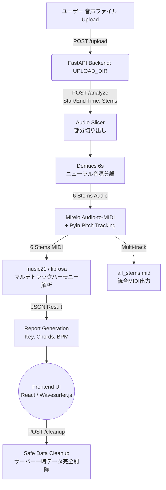

# 🎵 Music Phrase Analyzer


気になった楽曲フレーズを波形上で部分指定し、**Demucs（ニューラル音源分離）＋ Mirelo（Audio-to-MIDI）** でパート別MIDIを抽出。さらに **music21 / librosa** で音楽理論（コード進行・王道進行判定・スケール）と音響特性（リズム・シンコペーション・音色）を多角的に解析する耳コピ支援＆楽曲分析フルスタックローカルウェブアプリケーションです。

---

## ✨ Features

1. **6-Stem Audio Separation (Demucs 6s)**
   - Vocals, Bass, Drums, Guitar, Piano, Other/Synth の6トラックへ高精度に分離。
2. **Locally-Adaptive VAD & Audio-to-MIDI**
   - フロアノイズゲート(-50dBFS)とpyinピッチトラッキングにより、休符や静かな和音でもゴーストノートを発生させずMIDI化。
3. **Multi-Track Harmonic Fusion & Theory Analysis**
   - ベースのルート音判定と、上物トラック（Piano, Guitar, Other, Vocals）のハーモニクスを統合。
   - `music21` によるローマ数字（ディグリーネーム）解析、分数コード/展開形の認識、自動キー・BPM算出。
   - DAWスタイルの Bar.Beat (小節.拍) 表現と、任意のステム組み合わせに対する0.1秒単位のインタラクティブ再解析。
4. **Interactive Waveform & UI**
   - **Waveform View**: 音声のドラッグ＆ドロップ、フレーズの切り出し、全選択プリセット、リージョンループ再生。
   - **Chord Grid**: レスポンシブなコード進行グリッド。任意のコードをクリックすると、メイン波形の該当部分をワンショット再生（オートストップ機能付き）。
   - **Stem Mixer**: コードハイライトと同期した6つの独立ステム波形、マウスドラッグによる自由な領域選択・選択解除、WAV/MIDI個別ダウンロード、統合マルチトラックMIDI（`all_stems.mid`）のエクスポート。
5. **Safe Data Cleanup & Privacy Protection**
   - サーバー終了時（シャットダウン時）および Web UI 上の「データ全消去＆リセット」ボタンから、アップロード音源と中間生成物をワンクリックで完全消去。

---

## 🏗 Architecture / Data Pipeline



---

## 🛠 Local Setup Instructions

### Backend (Python / uv)
バックエンドはFastAPIと各種音声処理ライブラリを使用しています。

```bash
cd backend
# 仮想環境の作成とアクティベート
uv venv
source .venv/bin/activate  # Windows: .venv\Scripts\activate

# 依存関係のインストール
uv pip install -r requirements.txt

# サーバーの起動 (localhost:8000)
uvicorn app.main:app --reload --port 8000
```

### Frontend (npm / Vite)
フロントエンドはReact, TypeScript, Vite, Tailwind CSSで構築されています。

```bash
cd frontend
# 依存関係のインストール
npm install

# 開発サーバーの起動 (localhost:5173)
npm run dev
```

ワンクリックで両方を起動する場合はリポジトリルートの `./run.sh` をご利用ください。

---

## 📡 API Endpoints

- `POST /upload`
  - 楽曲ファイルをアップロードし、`file_id` を返します。
- `POST /analyze`
  - `file_id`, `start_time`, `end_time`, `stems` (抽出対象ステムの配列) を受け取り、波形スライス、音源分離、MIDI抽出、および初期のハーモニー・リズム解析を実行します。結果JSONと各種ファイルURLを返します。
- `POST /analyze/harmony`
  - インタラクティブな再解析用API。特定の `task_id` と選択した `stems` (例: `["bass", "piano"]`) を送信することで、指定ステムのみを用いた和音解析を即座に再計算します。
- `POST /cleanup`
  - サーバー上の一時アップロード音声および生成物（`uploads/`, `outputs/`）を安全に一括削除します。
- `GET /export/audio/{task_id}/{stem}`
  - 指定したタスクとステムの音声ファイル (WAV/MP3等) を取得・ダウンロードします。
- `GET /export/midi/{task_id}/{stem}`
  - 指定したタスクとステムのMIDIファイルを取得・ダウンロードします。`stem` に `all` を指定すると、全ステム統合MIDI (`all_stems.mid`) が取得できます。
- `GET /export/report/{task_id}`
  - 詳細な Markdown 分析レポートを取得します。
